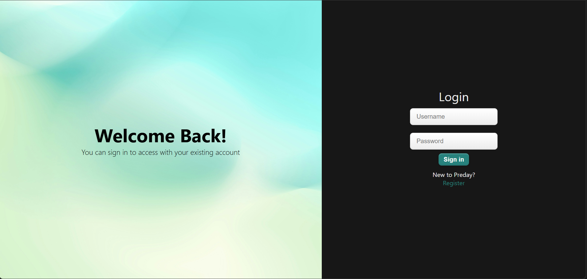
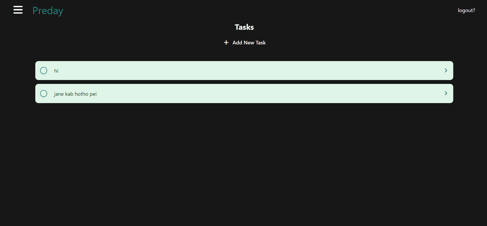
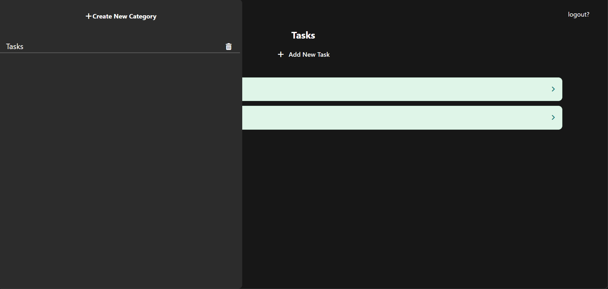

# PreDay

PreDay is a full-stack task management application designed to help users organize and manage their daily tasks. It is built with React.js on the frontend and Flask on the backend, with PostgreSQL providing persistent data storage.

The project started as a simple CRUD application and has evolved into a more complete full-stack system with JWT-based authentication, HTTP-only cookies, SQLAlchemy ORM, PostgreSQL, and cloud deployment.

## Live Application

**Frontend:** https://preday.netlify.app/

**Backend:** https://predaybackend.onrender.com/

---

## Screenshots

### Authentication



### Task Management





---

## Features

* User registration and login
* JWT-based authentication
* HTTP-only authentication cookies
* Protected backend routes
* User-specific task management
* Create and delete tasks
* RESTful API architecture
* PostgreSQL database
* SQLAlchemy ORM
* React Router based navigation
* Responsive user interface
* Separate frontend and backend deployment

---

## Technology Stack

### Frontend

* React.js
* JavaScript
* CSS
* React Router
* Fetch API

### Backend

* Python
* Flask
* Flask-SQLAlchemy
* REST API
* JWT Authentication

### Database

* PostgreSQL
* SQLAlchemy ORM

### Deployment

* Netlify — Frontend
* Render — Backend
* Render PostgreSQL — Database

---

## Application Architecture

```text
┌──────────────────────┐
│      React.js        │
│      Frontend        │
└──────────┬───────────┘
           │
           │ HTTP / REST API
           ▼
┌──────────────────────┐
│       Flask          │
│       Backend        │
└──────────┬───────────┘
           │
           │ SQLAlchemy
           ▼
┌──────────────────────┐
│     PostgreSQL       │
│      Database        │
└──────────────────────┘

Authentication
React Client
     │
     │ HTTP-only Cookie
     ▼
Flask JWT Authentication
```

---

## Authentication

PreDay uses JWT-based authentication with HTTP-only cookies.

The authentication flow works as follows:

1. A user registers or logs into the application.
2. The Flask backend validates the credentials.
3. After successful authentication, a JWT is generated.
4. The JWT is stored in an HTTP-only cookie.
5. The browser automatically includes the cookie with subsequent requests.
6. Protected API endpoints validate the JWT before returning or modifying user data.
7. Logging out invalidates the authenticated session.

Using HTTP-only cookies prevents client-side JavaScript from directly accessing the authentication token and provides a safer alternative to storing JWTs in local storage.

---

## Database

PreDay uses PostgreSQL for persistent data storage.

Database operations are handled through SQLAlchemy ORM, providing a structured model-based approach for interacting with the database.

The production PostgreSQL database is hosted through Render.

---

## Project Structure

```text
preday/
│
├── public/
│
├── src/
│   ├── components/
│   ├── pages/
│   ├── App.js
│   └── index.js
│
├── package.json
├── package-lock.json
├── .gitignore
└── README.md
```

The exact structure may evolve as the application continues to be developed.

---

## Local Development

### Prerequisites

Make sure the following are installed:

* Node.js
* npm
* Python 3.x
* PostgreSQL

### Clone the repository

```bash
git clone https://github.com/tejashhxd/preday.git
cd preday
```

### Install frontend dependencies

```bash
npm install
```

### Start the frontend

```bash
npm start
```

The React development server will start at:

```text
http://localhost:3000
```

### Backend

The Flask backend must be configured and running separately for authentication, database operations, and task management.

Backend configuration requires the appropriate PostgreSQL connection details and JWT secret to be provided through environment variables.

---

## Environment Variables

Sensitive configuration should be stored in environment variables rather than committed to the repository.

Example:

```env
DATABASE_URL=your_postgresql_database_url
JWT_SECRET_KEY=your_secret_key
```

Make sure to use the exact variable names required by the backend configuration.

Never commit database credentials, JWT secrets, API keys, or other sensitive information to the repository.

---

## Roadmap

The application is actively being developed. Planned improvements include:

* Task categories
* Task editing
* Due dates
* Task priorities
* Sorting and filtering
* Improved task organization
* UI and UX improvements
* Dark mode
* Additional productivity features

---

## Project Goals

PreDay was built as a practical full-stack project to gain experience in designing, developing, deploying, and maintaining a web application.

The project provided hands-on experience with:

* React.js
* Flask
* REST APIs
* JWT authentication
* HTTP-only cookies
* SQLAlchemy
* PostgreSQL
* Database migrations
* Frontend and backend integration
* Cloud deployment

---

## Deployment

The application is deployed using separate frontend and backend services.

The React frontend is deployed on Netlify, while the Flask backend and PostgreSQL database are hosted on Render.

This separation allows the frontend and backend to be developed, deployed, and maintained independently.

---

## Author

**Tejash**

GitHub: https://github.com/tejashhxd

---

## License

This project is currently intended for learning and personal development.
